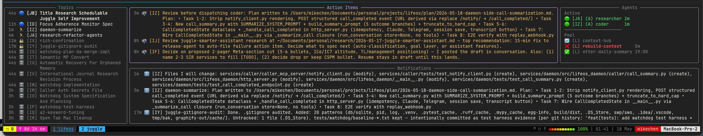

<div align="center">

<picture>
  <source media="(prefers-color-scheme: dark)" srcset="docs/assets/juggle-logo-dark.svg">
  
</picture>

**Parallel conversation threads for Claude Code.**

[](.claude-plugin/plugin.json)
[](https://www.python.org/)
[](https://github.com/tmux/tmux)
[](#prerequisites)

</div>



> **What you're seeing:** orchestrator (top-left) dispatching parallel coders by writing task files, nvim (top-right) holding open context, and the **Cockpit v2** (full-width bottom) tracking Topics, Action Items, and live Agents. Threads `[LJ]` and `[LK]` here are critiquing the same TF provider examples in parallel — one via Claude (juggle), one via Codex.

---

Claude Code runs one conversation at a time. A research detour, a parallel build, an unrelated question — each one competes for the same context window, and switching means losing your place.

Juggle turns a single Claude Code session into a multi-track workspace. Each topic lives in its own persistent thread (SQLite-backed, survives restarts and compactions), background agents do the heavy lifting in tmux panes while you stay focused, and the Cockpit dashboard shows every topic, action item, and live agent at a glance. When an agent finishes, a notification surfaces at the next natural pause — your main thread was never interrupted.

## Prerequisites

| Requirement | Version | Notes |
|---|---|---|
| **tmux** | 3.0+ | Background agents run in tmux panes |
| **Python** | 3.12+ | CLI, hooks, cockpit |
| **uv** | any | Required to launch the cockpit |
| **Claude Code CLI** | current | Orchestrator and agent runtime |
| **OS** | macOS / Linux | TTS (talkback) is macOS-only |

## Quickstart

```bash
# 1. Install
/plugin marketplace add mikechen/juggle
/plugin install juggle@juggle

# 2. Activate in any Claude Code session
/juggle:start

# 3. Open the live dashboard in a second terminal
uv run ~/.claude/plugins/juggle/src/juggle_cli.py cockpit

# 4. Dispatch your first background agent
/juggle:delegate
```

After `/juggle:start`, talk normally. Juggle detects topic shifts and opens new threads automatically. Use `/juggle:delegate` to send explicit work to a background agent.

## How it works

- **Topics** — each line of work gets a label (`A`–`ZZ`), its own SQLite-backed message history, and an independent context window. Switch anytime with `/juggle:resume-topic`.
- **Agents** — background workers (researcher / planner / coder) run in tmux panes, up to 20 concurrent. An auto-approver handles permission prompts so agents don't stall while you're focused elsewhere.
- **Cockpit** — a live dashboard (Topics | Action Items | Agents) updated every second. Textual-based with mouse drag-to-resize between panels (tmux mouse mode required).
- **Action Items** — persistent follow-ups created by agents or manually. Survive sessions until dismissed from the cockpit.
- **Hindsight memory** — opt-in long-term memory across sessions. Enable via `hindsight.enabled` in `~/.juggle/config.json`. See [docs/ARCHITECTURE.md](docs/ARCHITECTURE.md).
- **Self-healing watchdog** — a background daemon keeps agents and the cockpit alive. It reaps orphaned daemons under a global cap, debounces respawns, and verifies each agent actually started before use (a fresh worktree's trust prompt can't leak an idle agent). `juggle stop-watchdog --freeze` holds it down; `juggle start` clears the freeze and brings it back up.

## Project Autopilot

Hand Juggle a project objective and it delivers the whole thing end-to-end. The objective is decomposed into a **task graph** persisted in the DB (one node per unit of work, edges for dependencies), and the watchdog tick drives every node to a verified state without you dispatching anything by hand. There is no separate "arm" step: once autopilot is on, the tick auto-dispatches the ready nodes of every active project.

```bash
/juggle:toggle-autopilot <project>   # decompose a project into a task graph, then let the tick run it
/juggle:toggle-autopilot             # no arg → toggle global autonomous mode on/off
juggle autopilot status              # global flag + per-project graph progress (--json for machine-readable)
```

**The flow** for a project:

1. **Decompose** — the orchestrator breaks the objective into a task-graph spec written to `<data_dir>/graphs/<project>-graph.md`. One `## <node-id>: <Title>` section per node, with optional `deps:` and `verify_cmd:` lines and the dispatch prompt as the body.
2. **One approval gate** — the spec (nodes, deps, verify_cmds) is surfaced in chat; you reply to approve before anything runs.
3. **Load** — `juggle project-graph load <file> --project <id>` validates the graph (cycle check, unknown/duplicate node ids, empty prompts, verify_cmd lint).
4. **Tick-driven execution** — the watchdog is the sole dispatcher. Each tick it atomically claims every `ready` node (deps all verified), lazily creates a thread, dispatches a coder agent with a prompt hydrated from upstream nodes' structured handoffs plus integrated diffstat, then on completion runs the node's `verify_cmd` **inside the worktree, pre-merge**, so nothing merges to main unverified. Verified nodes unblock their dependents; a failed node blocks its transitive dependents and files a HIGH action item.

Nodes are **tick-owned**: the orchestrator never dispatches them by hand, it only monitors and reports. Node states, transitions, and failure channels are documented in [docs/ARCHITECTURE.md](docs/ARCHITECTURE.md).

### Example: "Add OAuth login to a web app"

Decomposes into four nodes with a diamond shape: a schema migration fans out to the backend route and the frontend button, which join at an end-to-end test.

```
        migrate
        /      \
    backend   frontend
        \      /
         e2e
```

Start it:

```bash
/juggle:toggle-autopilot oauth-login
```

Excerpt from the generated spec (`<data_dir>/graphs/oauth-login-graph.md`):

```markdown
## migrate: Add oauth_accounts table
verify_cmd: uv run pytest tests/test_migrations.py -q
Create the oauth_accounts migration linking provider+subject to a user id.

## backend: OAuth callback route
deps: migrate
verify_cmd: uv run pytest tests/test_oauth_routes.py -q
Add /auth/oauth/callback exchanging the code for a token and upserting oauth_accounts.

## e2e: End-to-end login flow
deps: backend, frontend
verify_cmd: uv run pytest tests/test_e2e_oauth.py -q
Drive the full login round-trip against a stub provider and assert a session cookie.
```

Approve when prompted, then load:

```bash
juggle project-graph load <data_dir>/graphs/oauth-login-graph.md --project oauth-login
```

While it runs, monitor with `juggle autopilot status` (`--json` for machine-readable):

```
project oauth-login   2/4 done · 1 running · 1 ready
  ✓ migrate     verified
  ⟳ backend     running     (thread BJ)
  ● frontend    ready
  ○ e2e         pending     deps: backend, frontend
```

The cockpit shows an aggregate project row with per-node glyphs sourced from node state, e.g. `oauth-login  2/4 done, 0 failed, 1 ready`.

**Failure & resume:** a node that fails verification blocks its dependents; fix that node's section in the spec and re-load. `project-graph load` is a guarded upsert that refuses to touch nodes already dispatching/running/integrating/verified and only updates pending/ready/failed nodes. Blocked nodes resume automatically once their failed ancestor reloads.

## Slash commands

| Command | Description |
|---------|-------------|
| `/juggle:start` | Activate juggle mode for the session |
| `/juggle:delegate` | Wizard: pick role, write prompt, dispatch agent |
| `/juggle:resume-topic <id>` | Switch to a topic, restoring full context |
| `/juggle:remember <text>` | Explicitly save something to Hindsight memory |
| `/juggle:toggle-autopilot [project]` | Autonomous mode; with a project arg, decomposes it into a task graph the watchdog runs end-to-end |
| `/juggle:toggle-talkback` | Toggle TTS voice notifications (macOS) |

Full catalog: [`commands/`](commands/)

### CLI

A few capabilities are CLI verbs rather than slash commands:

```bash
juggle verify              # run the full test suite once (extra args pass through to pytest)
juggle autopilot status    # global autopilot flag + per-project task-graph progress
juggle cockpit             # open the live dashboard (see below)
```

## Cockpit

```bash
uv run ~/.claude/plugins/juggle/src/juggle_cockpit.py
# or
uv run ~/.claude/plugins/juggle/src/juggle_cli.py cockpit
```

Three columns: **Topics** (status + label + title), **Action Items** (persistent follow-ups), **Agents** (role, model, assigned thread, idle age). Refreshes every second. Read-only — never writes to the DB.

## Configuration

Defaults in `src/juggle_settings.py`. Override in `~/.juggle/config.json` (deep-merged) or via env vars:

| Key | Default | Effect |
|-----|---------|--------|
| `max_threads` | `10` | Concurrent open topics (`JUGGLE_MAX_THREADS`) |
| `max_agents` | `20` | Concurrent background agents (`JUGGLE_MAX_BACKGROUND_AGENTS`) |
| `message_history_token_budget` | `1500` | Thread history tokens injected per agent prompt |
| `hindsight.enabled` | `false` | Long-term memory across sessions |
| `talkback.enabled` | `false` | TTS completion notifications (macOS) |

Data and logs live at `$CLAUDE_PLUGIN_DATA/juggle.db` and `juggle.log`, preserved across plugin upgrades. `juggle integrate` always runs the full test suite before merging (the older `test_scope` / `quarantine_tests` keys are inert).

## Docs

- [Architecture](docs/ARCHITECTURE.md) — data flow, SQLite schema, hook lifecycle
- [Topic lifecycle](docs/topic-lifecycle.md) — states, transitions, auto-archive rules
- [Agent context injection](docs/agent-context-injection.md) — how context reaches dispatched agents
- [Commands](commands/) — full slash command catalog
- [Changelog](CHANGELOG.md)
